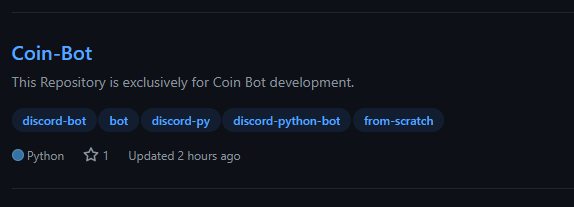
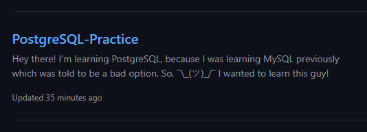
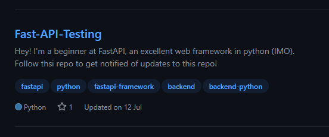
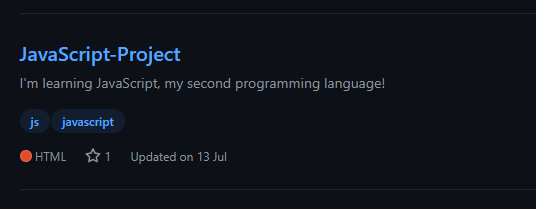
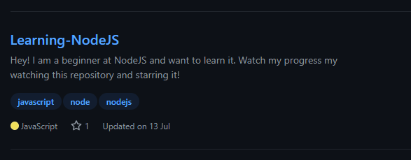

# 👋 About

Hi there! I'm **Science Done Right**, an Indian self learned python programmer.
I'm an Intermediate-Advanced Python nerd who does goofy stuff in python and frequently abandons old projects LOL

## Contact Me

By Discord (do NOT send me friend requests, my DMs are open): **Science Done Right#6969**
By Email: sciencedoneright5@gmail.com
By Fiverr (Will be Inactive for some time): https://www.fiverr.com/code_done_right?up_rollout=true

# 🌟 Commonly Contributed To

**1.**
⭐ [Coin Bot](https://github.com/Code-Done-Right/Coin-Bot)
This is my main project on my account and is a discord.py bot, named CoinBot.

**2.**
[PostgreSQL Practice](https://github.com/Code-Done-Right/PostgreSQL-Practice)
This repo is for practicing and learning PostGreSQL.

**3.**
[Fast API](https://github.com/Code-Done-Right/Fast-API-Testing)
This repo is dedicated to the popular python web framework, FastAPI!
I'll be learning this amazing module here!

**4.**
[JavaScript](https://github.com/Code-Done-Right/JavaScript-Project)
This repository is for javascript, the popular for-website language.

**5.**
[Node JS](https://github.com/Code-Done-Right/Learning-NodeJS)
Learning the non-web "language", NodeJS.

# 👥 Promotion

Anyways, I'm also post okay videos on YouTube so maybe [go check it out..?](https://youtube.com/Sciencedoneright)

[Shameless discord server promotion:](https://discord.gg/cBRpmW2Csh)
